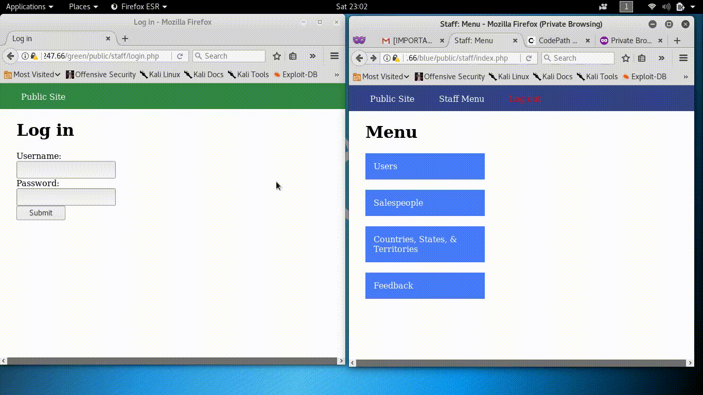
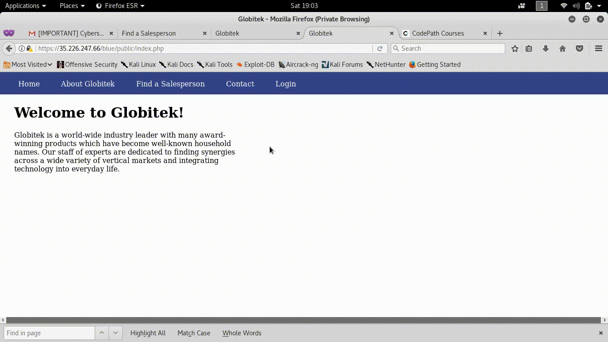
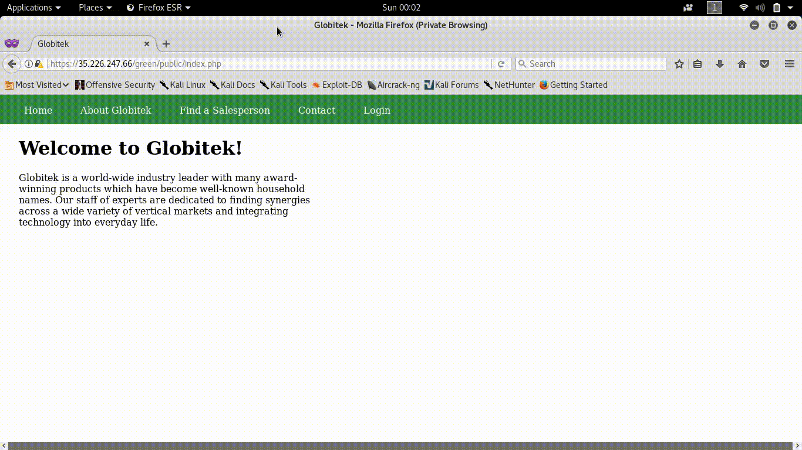
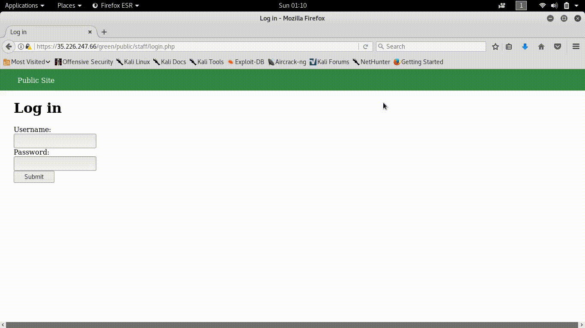
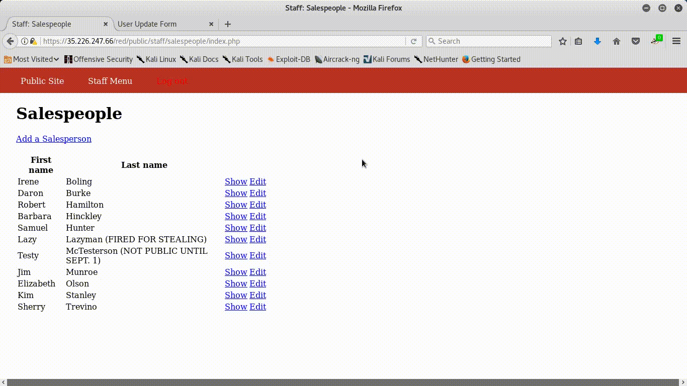
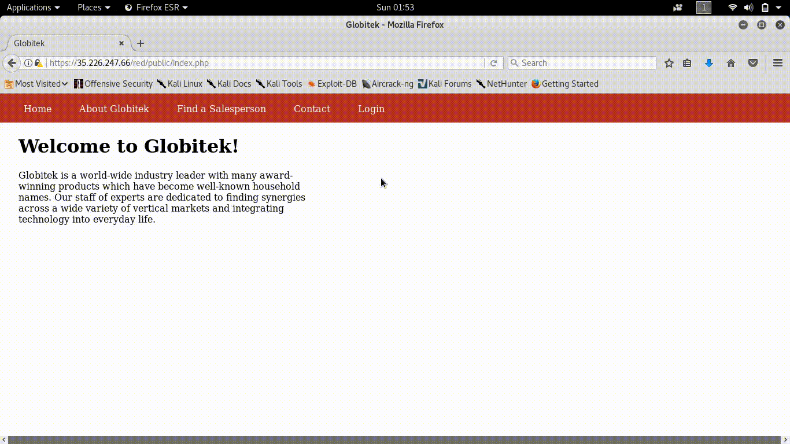

# Project 8 - Pentesting Live Targets

Time spent: 9 hours spent in total

> Objective: Identify vulnerabilities in three different versions of the Globitek website: blue, green, and red.

The six possible exploits are:
* Username Enumeration
* Insecure Direct Object Reference (IDOR)
* SQL Injection (SQLi)
* Cross-Site Scripting (XSS)
* Cross-Site Request Forgery (CSRF)
* Session Hijacking/Fixation

Each version of the site has been given two of the six vulnerabilities. (In other words, all six of the exploits should be assignable to one of the sites.)

## Blue

Vulnerability #1: Session Hijacking/Fixation

Vulnerability #2: SQL Injection

## Green

Vulnerability #1: Cross-Site Scripting

Vulnerability #2: Username Enumeration

## Red

Vulnerability #1: Cross-Site Request Forgery

Vulnerability #2: Insecure Direct Object Reference

## Notes

None 

